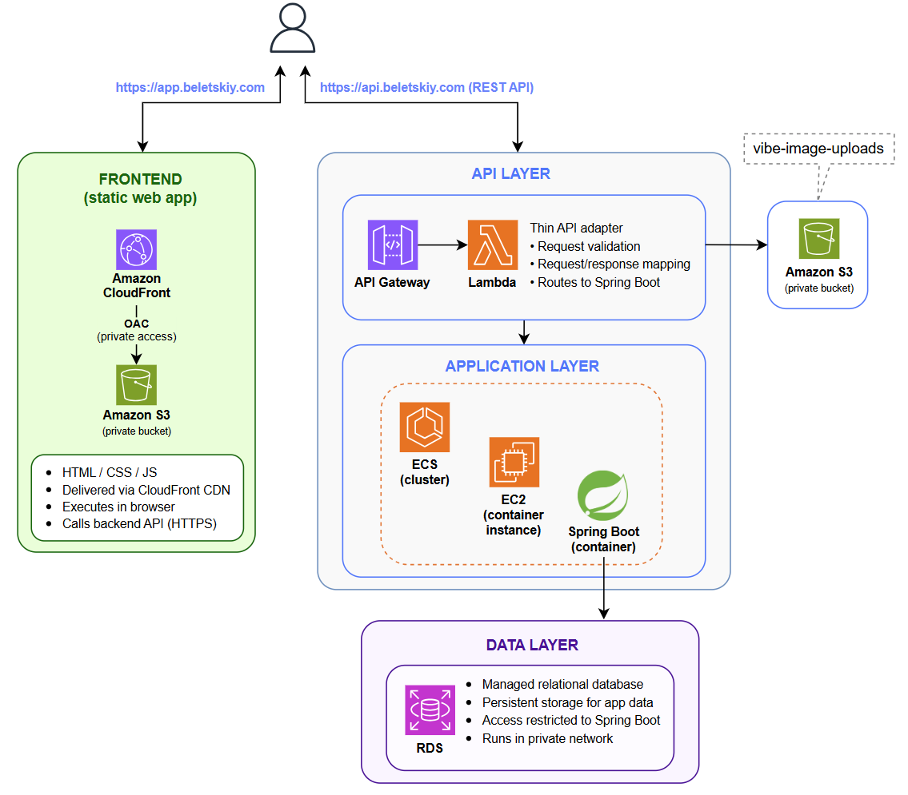

# AWS Fullstack Project Backend

Course: Cloudutveckling (MU25)  
Student: Vitaliy Beletskiy  
Date: 2026-05-22  

This repository contains the backend part of the AWS fullstack project.

## Frontend Repository

The repository with the static frontend application is available here:

https://github.com/VitaliyBeletskiy/mu25-app-beletskiy-com

## AWS Access

Frontend application:

https://app.beletskiy.com/

Backend REST API:

https://api.beletskiy.com/

## Documentation

[Individual Report (PDF)](docs/Vitaliy-Beletskiy-AWS-Individual-Report.pdf)

## Lambda Functions

All AWS Lambda functions used in the project are located in:

[Lambda Functions](lambdas/)

## Project Infrastructure Scheme

